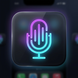

# 🎙️ VoxFlow — Universal Smart Voice Dictation

<div align="center">



**Transform speech into perfectly formatted, tone-adapted text on any website in real time.**

[](manifest.json)
[](https://www.google.com/chrome/)
[](LICENSE)

[Installation](#-installation-guide) • [Key Features](#-key-features) • [Voice Commands](#-spoken-punctuation--commands) • [Architecture](#-project-structure)

</div>

---

## 🌟 What is VoxFlow?

**VoxFlow** is a modern, lightweight Chrome extension (Manifest V3) that injects a floating glassmorphic voice dictation capsule into any webpage. Whether you are composing emails in **Gmail**, drafting notes in **Notion**, messaging on **Slack**, tweeting on **X (Twitter)**, or prompting **ChatGPT**, VoxFlow listens, removes stutters, adds punctuation, adapts tone, and automatically types the words directly into your active input field.

---

## ✨ Key Features

- **🪄 Universal Direct Typing:** Automatically types polished text right where your cursor is positioned (`<input>`, `<textarea>`, or `contenteditable` editors). Preserves native `Ctrl + Z` undo history.
- **⚛️ Framework Compatible:** Fully tested with React, Next.js, Vue, Angular, and Svelte input event listeners.
- **🎨 Glassmorphic Floating Capsule:** Draggable, minimizable, and equipped with a live audio visualizer soundwave.
- **⚡ Instant Local Polish (Zero-Lag & Offline):**
  - Auto-capitalizes sentences and lone pronouns.
  - Cleans verbal crutches (*"um"*, *"uh"*, *"you know"*).
  - Eliminates stuttered words (*"I I think think"* → *"I think"*).
  - Converts spoken punctuation aloud (*"period"*, *"comma"*, *"new line"*, *"bullet point"*).
- **🎭 6 Built-In Tone Modes:**
  1. **✨ Clean & Punctuate:** Natural grammar cleanup and formatting (default).
  2. **💼 Professional:** Articulate, executive-level wording for corporate emails.
  3. **💬 Friendly Chat:** Warm and conversational for messaging and social chats.
  4. **📋 Bullet Points:** Converts continuous thoughts into structured checklist bullets (`• `).
  5. **⚡ Concise:** Cuts fluff and produces a tight, punchy summary.
  6. **🎙️ Raw Dictation:** Verbatim, unedited transcription.
- **🤖 Optional Cloud AI (Gemini & OpenAI):** Plug in a free Google Gemini or OpenAI API key for deep contextual rewrites. If omitted, VoxFlow runs 100% locally with zero external network requests.
- **🔊 Zero-Dependency Audio Chimes:** Built-in Web Audio API synthesizers provide gentle, ascending and descending tonal cues when listening begins or finishes.
- **🌐 Multilingual Support:** Supports English (US/UK/IN/AU), Spanish, French, German, Hindi, Japanese, Chinese, Portuguese, Italian, and more.
- **⌨️ Global Hotkey:** Toggle dictation anytime with <kbd>Alt</kbd> + <kbd>Shift</kbd> + <kbd>V</kbd>.

---

## 🚀 Installation Guide

### Load Unpacked Extension in Chrome / Edge / Brave

1. Open your browser and navigate to:
   ```text
   chrome://extensions
   ```
   *(For Microsoft Edge, go to `edge://extensions`)*
2. In the top-right corner, toggle on **"Developer mode"**.
3. Click the **"Load unpacked"** button in the top toolbar.
4. Select this project directory:
   ```text
   c:\Users\MY PC\.gemini\antigravity-ide\scratch\voxflow-voice-assistant
   ```
5. **Done!** VoxFlow is now active and ready on every website you visit.

---

## 🗣️ Spoken Punctuation & Commands

While dictating, speak natural punctuation commands to format your writing on the fly:

| Say | Output | Description |
| :--- | :---: | :--- |
| `"period"` or `"full stop"` | `.` | Inserts a period and capitalizes the next letter |
| `"comma"` | `,` | Inserts a comma with proper trailing spacing |
| `"question mark"` | `?` | Inserts a question mark |
| `"exclamation mark"` | `!` | Inserts an exclamation mark |
| `"colon"` | `:` | Inserts a colon |
| `"semicolon"` | `;` | Inserts a semicolon |
| `"new line"` or `"enter"` | `\n` | Single line break |
| `"new paragraph"` | `\n\n` | Double line break |
| `"bullet"` or `"bullet point"` | `\n• ` | Creates an indented bullet list item |
| `"quote"` ... `"end quote"` | `"..."` | Wraps words in quotation marks |

---

## 🎛️ Keyboard Shortcuts

| Shortcut | Action |
| :--- | :--- |
| <kbd>Alt</kbd> + <kbd>Shift</kbd> + <kbd>V</kbd> | Toggle Voice Dictation Start / Stop |
| <kbd>Escape</kbd> *(while open)* | Clear or close transcript preview |

> **Customizing the Shortcut:** You can change this hotkey anytime by going to `chrome://extensions/shortcuts` in your browser.

---

## 📁 Project Structure

```text
voxflow-voice-assistant/
├── manifest.json              # Chrome Manifest V3 declaration & permissions
├── background.js              # Service worker (keyboard shortcuts & AI polish proxy)
├── content.js                 # Floating capsule UI, speech recognition & direct insertion
├── content.css                # Glassmorphic styles, keyframe animations & themes
├── README.md                  # Project documentation
├── LICENSE                    # MIT open-source license
├── icons/                     # Extension raster icons
│   ├── icon16.png
│   ├── icon32.png
│   ├── icon48.png
│   └── icon128.png
└── popup/                     # Toolbar settings popup
    ├── popup.html             # Options UI (tone, language, AI keys, live mic test)
    ├── popup.css              # Dark theme popup design
    └── popup.js               # Settings sync via chrome.storage.sync
```

---

## 🔒 Privacy & Permissions

- **Local Processing:** By default, all speech recognition is handled natively by the browser's speech synthesis engine.
- **No Remote Audio Transmission:** Audio is never transmitted to external servers by VoxFlow.
- **Optional AI Keys:** If you provide an OpenAI or Gemini API key, only the transcribed text string is sent over HTTPS to the selected provider for rewriting. Keys are stored safely in your browser's local `chrome.storage.sync`.
- **Permissions Explained:**
  - `storage`: Saves your preferred tone, language, and settings across tabs.
  - `activeTab`: Detects focused inputs when triggered by shortcuts.
  - `contextMenus`: Adds the right-click "Start VoxFlow Voice Dictation" option.

---

## 📄 License

MIT License. Crafted with precision for high-productivity voice workflows.
